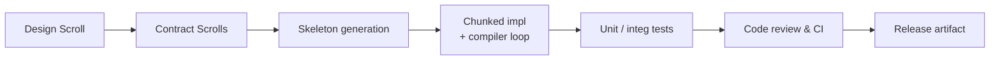

# Scroll Core ⭑ Project‑Level Workflow Plan

_Last updated: 2025‑04‑19_

---

## 1 · Purpose
Provide a pragmatic, end‑to‑end execution framework that bridges high‑level design specs into delivered, production‑quality Rust code for **Scroll Core**. The plan assumes a small core team (you + ChatGPT) today, but scales to additional engineers later.

## 2 · Guiding Principles
1. **Contract‑first** – Every module gets a one‑page Contract Scroll (name, purpose, public API, constraints, tests).
2. **AI‑pair loop** – Tight `spec → generate → compile → test → refine` cycles capped at ≈100 LoC per prompt.
3. **Fail‑early** – Compile & unit‑test after each chunk; fuzz once per day.
4. **Observability** – Everything meaningful (tests, benches, docs, ADRs) lives in the repo & CI; no tribal knowledge.
5. **Sustainable cadence** – 2‑week release trains, semantic versioning, feature flags for risky changes.

## 3 · Workflow Overview

## 4 · Phase 0 — Architecture Validation
| Activity | Owner | Output |
|----------|-------|--------|
| External architecture review (2 peers) | System Architect | Signed ADR‑001 |
| Risk/assumption log (performance of YAML parser, memory size) | Lead Dev | `RISKLOG.md` |

## 5 · Phase 1 — Refactor Execution
### 5.1 Work Breakdown Structure (WBS)
| Epic | Modules / Tasks | Est. pts |
|------|-----------------|----------|
| **Archive 2.0** | `archive_loader`, `archive_memory`, `scroll_access_log`, `mythic_heat` | 8 |
| **Parser harden** | Grammar split, error mapping | 5 |
| **Cache layer** | `cache_manager`, eviction algo | 5 |
| **CLI polish** | `scrollctl` commands, colored logs | 3 |

### 5.2 Sprint Cadence
* 1‑week sprints until beta.
* Definition of Done (DoD): compiles with `--release`, 90 % unit‑coverage, clippy clean, docs updated.

### 5.3 AI‑First Coding Loop (per module)
1. **Generate skeleton** – Prompt ChatGPT: _“Generate module skeleton only – structs, traits, fn sigs, doc comments.”_
2. **Iterate in ≤100 LoC chunks** – Copy compiler error back → _“Fix just this error; no other edits.”_
3. **Write happy‑path test** (ChatGPT) → run.
4. **Edge tests & benches** added manually.
5. **Merge when green**.

## 6 · Tooling Stack
| Purpose | Tool |
|---------|------|
| Build | `cargo`, `rustup` |
| Lint & fmt | `rustfmt`, `clippy --all-targets -D warnings` |
| Testing | `cargo nextest`, `proptest`, `criterion` |
| CI | GitHub Actions (matrix: stable, beta, nightly) |
| Docs | `cargo doc`, mdBook for domain docs |
| Release | `cargo-release`, GitHub Releases |

## 7 · Quality Gates
* **Unit** & **integration** tests ≥90 % coverage.
* `cargo audit` and `cargo outdated` run weekly.
* Benchmarks must not regress >5 % without ADR.
* Security review for crates with `unsafe` blocks.

## 8 · Documentation Artifacts
| Doc | Location |
|-----|----------|
| ADRs | `/docs/adr/ADR‑xxx.md` |
| Contract Scrolls | `/contracts/<module>.md` |
| Changelog | `CHANGELOG.md` (Keep‑a‑Changelog format) |
| Public API Docs | generated from `///` comments |

## 9 · CI/CD Pipeline
1. **Lint & Test** – On every PR; fail‑fast.
2. **Build Artifacts** – Release profile; attach to PR.
3. **Security Scan** – `cargo audit`, `trivy` (CLI artifacts).
4. **Publish** – On `main` tag `vX.Y.Z` → crates.io (if lib) + GitHub binaries.

## 10 · Roles & RACI
| Role | R | A | C | I |
|------|---|---|---|---|
| System Architect | ·  | **✓** | ✓ | ✓ |
| Lead Dev | **✓** | · | ✓ | ✓ |
| CI Custodian | **✓** | · | · | ✓ |
| QA | · | · | **✓** | ✓ |

_✓ = primary responsibility_

## 11 · Risk & Mitigation Snippets
* **Parser performance** – Build micro‑bench spike; budget 2 days; set 50 µs/scroll target.
* **YAML schema drift** – Add `yaml-test-fixtures/` with snapshot tests; fail CI on new warnings.
* **AI hallucination** – Limit ChatGPT edits per chunk; enforce test pass before commit.

## 12 · Next Steps Checklist
- [ ] Review & approve this plan (sign off in `ADR‑0001-workflow.md`).
- [ ] Create GitHub Project “Scroll Core Refactor”.
- [ ] Stub Contract Scrolls for Phase 1 epics.
- [ ] Bootstrap CI pipeline (lint + test).
- [ ] Start Sprint 0 (setup & scaffolding).

---

> _“Strong foundations invite bolder arches.” — Scroll Core Manifest_

